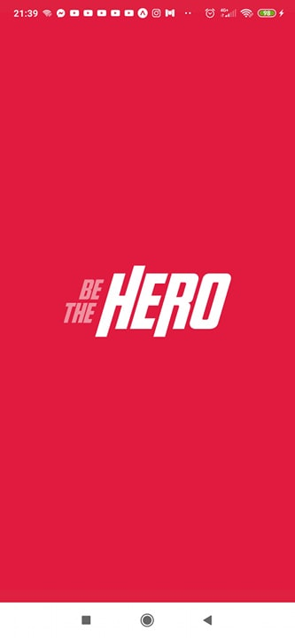

# semana-omnistack-11

Este projeto foi desenvolvido durante a Semana OmniStack 11.0 ofertada pela [RocketSeat](https://rocketseat.com.br/week/aulas/11.0).  
Ele consiste em uma aplicação que permite que pessoas possam ajudar em projetos de organizações não governamentais (ONGs).

---

## Estrutura do projeto

O projeto está separado em 3 módulos, sendo eles:

- [backend](backend) módulo que disponibiliza uma API para consulta e alteração de dados
- [frontend](frontend) módulo reponsável pela interface web
- [mobile](mobile) módulo reponsável pela interface mobile

## Funcionalidades atuais

* Cadastrar uma nova ONG
* Cadastrar um projeto de uma ONG
* Deletar um projeto de uma ONG
* Listar todos os projetos de uma ONG
* Login \& Logout
* Entrar em contato com uma ONG via E-mail e/ou Whatsapp
* Sistema de autenticação via JSON Web Token (JWT)

## Implementações futuras

* Filtrar ONGs por nome e localização
* Filtrar projetos por nome e custo de colaboração
* Adicionar responsividade nas páginas web
* Permitir login e cadastro de ONGs e de projetos no aplicativo

## Screenshots


---




## Como executar o projeto

Basta clonar o repositório  
```
$ git clone https://github.com/Pacheco95/semana-omnistack-11.git
$ cd backend && npm install && npm start
$ cd frontend && npm install && npm start
$ cd mobile && npm install && npm start
```

---

Para executar o aplicativo será necessário que você instale o [expo](https://play.google.com/store/apps/details?id=host.exp.exponent&hl=pt_BR).  
É necessário que o computador e o smartphone estejam conectados na mesma rede.
Após executar `npm start` no diretório `mobile` basta abrir o aplicativo do expo e escanear o QRCode.
Na tela do expo você deverá copiar o endereço ip (não precisa da porta) e atualizá-lo no arquivo [api.js](mobile/src/services/api.js)
